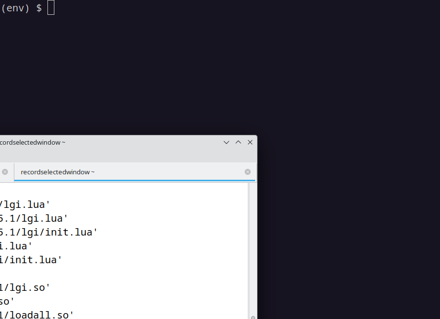

# What is CRAG?

 CRAG is a tool that generates road geometries for testing the lane keeping components of automated driving systems. CRAG relies on combinatorial testing with parameters of the combinatorial model representing high-level features of the road like "long segment", "short segment", "medium turn", and "sharp turn".

# Requirements

CRAG requires
  - `python` (with version >=3.8, <3.12) for installation and standard operation,
  - either one of `pict`, `ACTS`, or `CAgen` as a backend for combinatorial test suite generation.

## Links of backend tools

 - `pict`: [https://github.com/microsoft/pict](https://github.com/microsoft/pict)
 - `ACTS`: [https://csrc.nist.gov/projects/automated-combinatorial-testing-for-software/downloadable-tools](https://csrc.nist.gov/projects/automated-combinatorial-testing-for-software/downloadable-tools)
 - `CAgen`: [https://matris.sba-research.org/tools/cagen](https://matris.sba-research.org/tools/cagen)
 
Linux, macOS, and Windows versions of the tool `pict` are provided in `external_tools` folder.


# Installation

Please use Python with version greater than or equal to 3.8 and strictly smaller than 3.12. In addition, we recommend the use of [`venv`](https://docs.python.org/3/library/venv.html) of Python for installation and use.

 - First install the `venv` module in Python, if it’s not already installed on your system.

 - Navigate to your `crag_project` folder and run the following command to create a new virtual environment named `env`:

~~~sh
python -m venv env
~~~

 - Activate the virtual environment. The command you use depends on your operating system. On macOS and Linux, run `source env/bin/activate`; on Windows run `env\Scripts\activate`. If you are running a terminal with a shell different from `bash` (e.g., `fish`, `zsh`, `csh`) you can find alternative scripts in `env/bin` folder.

- With the virtual environment activated, proceed with installation of [`poetry`](https://python-poetry.org/) build tool by running

~~~sh
pip install poetry
~~~

Once, `poetry` is installed, you can now build a wheel file in `dist` folder by running the following command inside `crag_project` folder:

~~~ sh
poetry build
~~~

Next, we use pip to install the built wheel file:
~~~sh
pip install dist/*.whl
~~~

- To deactivate the virtual environment when you're done, simply type `deactivate` at the command line. To run crag again, you can reactivate the virtual environment.


# Basic Usage

CRAG provides a standalone executable `crag` that allows one to run CRAG and communicate with it through standard input and output.

CRAG also provides a library of functions that can be used in other python projects.

Below we provide a detailed overview on these two modes of operation.


## Usage as a standalone tool

In `examples/standalone` folder, you can find `python` code that uses CRAG as a standaline tool. In what follows, we explain how `crag` operates through standard input and output.

When installed, CRAG provides an executable `crag`. It accepts many command line arguments. While the arguments related to the choice of backend and backend parameters are necessary, the rest of the arguments are optional and CRAG will be able to run on default values.

To run `crag`, we first ensure that we have a backend combinatorial test suite generator (one of PICT, ACTS, or CAgen). In this example, we will use `pict`. Assuming we are on Linux, we can run `crag` as:

~~~sh
crag --backend pict --pict-executable-filepath external_tools/pict/pict-linux
~~~

At this point, if our installation is successful, we should see a list of values `[[[10, 71.63667202007883], [11.340662516839169, 71.75580101774482], ...`. These values correspond to the points of the first road that `crag` generates (specifically list of (x,y) coordinates). Now `crag` is waiting for a feedback on this road. We need to evaluate this road based on a criteria and return through standard input a list. The list should be constructed in a way that it can be parsed as a `json` string. Furthermore, the first value should be a numeric value. Smaller numeric values indicate a better fitness. So at this point we can type

~~~sh
[5.5]
~~~

and press Enter. `crag` will return another list representing a road. We should againprovide a numeric value to characterize its fitness. We can type

~~~sh
[42]
~~~

and press Enter. CRAG uses these numeric values to generate roads that fit better to our criteria.

When we want to stop crag, we provide an array with the last entry "EXIT" twice after the provided road points

First:
~~~sh
[15, "EXIT"]
~~~

Second:
~~~sh
[1555, "EXIT"]
~~~


### Standalone use case for vehicles with PID-controlled bicycle models

In `crag_project/examples/standalone` folder, we provide source code of a python project that uses `crag` executable to find roads that result in large `jerk` values for a vehicle with PID-controlled bicycle model.

The code can be run using

~~~sh
cd crag_project/examples/standalone
python example_as_a_standalone.py
~~~



### Arguments for standalone use

The standalone executable `crag` accepts several command line arguments for customization. We provide the full list below:


#### CORE PARAMETER arguments
- `--use-seed`: type=bool, default=True, (Use generated tests of previous strength as seeds or not.)
- `--seed-best`: type=bool, default=True, (When preparing seeds take only the best tests.)
- `--best-ratio`: type=float, default=0.1, (Percentage of top scoring tests taken as seed.)
- `--resample`: type=bool, default=True, (Given a road configuration, resample a road geometry and evaluate it even if an evelation was done before.)
- `--fitness-aggregation-method`: choices=['minimum', 'average', 'maximum'], default='average', (When a test is rerun for evaluation, how to aggregate available fitness values.)
- `--max-strength`: type=int, default=5, (Maximum strength for combinatorial test generation.)

#### ROAD GEOMETRY arguments
- `--road-section-count`: type=int, default=5, (How many sections each generated road should have.)
- `--param-value-count`: type=int, default=5, (How many values length and kappa parameters in a section has.)
- `--max-road-scalar`: type=float, default=1.2, (The scalar for the ratio of maximum road length to map size.)
- `--min-road-scalar`: type=float, default=0.6, (The scalar for the ration of minimum road length to map size.)
- `--lane-width`: type=float, default=10, (The width of lane in units consistent with map size.)
- `--map-size`: type=float, default=200, (Edge length of a square map to be considered for road generation.)
- `--min-radius`: type=float, default=15, (Threshold in units consistent with map size for sharpness of generated roads.)

#### BACKEND arguments (Necessary)
- `--backend`: choices=["pict", "acts", "cagen"], default="pict", (Backend used for combinatorial test generation for given strength and seeds.)

#### ACTS-specific arguments
- `--acts-java-executable-filepath`: type=str, default="java", (Java executable filepath as needed by ACTS.)
- `--acts-jar-path`: type=str, default="acts_3.2.jar", (Filepath of jar file for ACTS.)
- `--acts-input-filepath`: type=str, default="ACTSInput.txt", (Filepath for input to be used in ACTS.)
- `--acts-output-filepath`: type=str, default="ACTSOutput.txt", (Filepath for output to be used in ACTS.)

#### CAgen-specific arguments
- `--cagen-executable-filepath`: type=str, default="java", (CAgen (fipo-cli) executable filepath as needed by CAgen.)
- `--cagen-input-filepath`: type=str, default="CAgenInput.txt", (Filepath for input to be used in CAgen.)
- `--cagen-output-filepath`: type=str, default="CAgenOutput.txt", (Filepath for output to be used in CAgen.)

#### PICT-specific arguments
- `--pict-executable-filepath`: type=str, default="pict", (Filepath for the executable of PICT.)
- `--pict-model-filepath`: type=str, default="PICTModel.txt", (Filepath for the model to be used in PICT.)
- `--pict-seed-filepath`: type=str, default="PICTSeed.txt", (Filepath for the seeds to be used in PICT.)


## Usage as a library

In `examples/library` folder we provide an example use of CRAG as a library. More specifically, we create a testing tool that uses the code-pipeline of Cyber-physical systems (CPS) testing competition at [SBFT 2023](https://sbft23.github.io).

### Setting parameters

In our example, we want to use the search and road geometry parameters of [our tool](https://github.com/ERATOMMSD/crag-sbft2023competition) that participated in the competition. To this end we define two dictionaries `core_params` and `geometry_params`:

~~~python
core_params = {}
core_params["use_seed"] = True
core_params["seed_best"] = True
core_params["best_ratio"] = True
core_params["resample"] = True
core_params["fitness_aggregation_method"] = "minimum"
core_params["max_strength"] = 5

geometry_params = {}
geometry_params["road_section_count"] = 5
geometry_params["param_value_count"] = 5
geometry_params["max_road_scalar"] = 1.2
geometry_params["min_road_scalar"] = 0.6
geometry_params["lane_width"] = 10
geometry_params["map_size"] = 200
geometry_params["min_radius"] = 15
~~~

The meaning of the parameters in these dictionaries are explained through [command line arguments discussed above](###arguments-for-standalone-use).

### Defining evaluate_function

The goal in the competition is to find road geometries that make an automated driving agent exit its prespecified lane. To characterize this goal, we define `evaluate_function` that checks whether generated roads are inside the given map, whether they are reframble to be placed in the map, and whether they are not self-intersecting. If a road passes these checks, it is passed to the competition pipeline, which returns numeric values indicating position the vehicle with respect to lane boundaries. We use these numeric values to return a single floating point number to indicate the fitness of a road.

~~~python
def evaluate_function(road):
    """Evaluate function takes a road generated by CRAG
        and returns a numeric value characterizing the
        (negative) fitness of a road. A road with a smaller
        numeric value is preferable in search. This specific
        function evaluates the road over driving agents
        specified in SBFT'23 Competition."""
    (road_points, is_in_map, is_reframable) = road
    if (not is_in_map) and (not is_reframable):
        return [1000]

    # Check self-intersections and reframe if possible
    if rg.is_likely_self_intersecting(road_points, geometry_params["lane_width"]):
        return [1000]

    if not is_reframable:
        return [1000]

    the_test = RoadTestFactory.create_road_test(road_points)
    test_outcome, description, execution_data = self.executor.execute_test(the_test)
    if execution_data:
        min_oob_distances = heapq.nsmallest(self.MIN_OOB_SAMPLE_SIZE,
                                            [getattr(x, 'oob_distance') for x in execution_data])
        # Return average of MIN_OOB_SAMPLE_SIZE number of smallest oob distances
        return [sum(min_oob_distances) / len(min_oob_distances)]
    else:
        return [100] # Road determined INVALID
~~~

### Defining budget_availability_function

Since the code-pipeline of the competition provides a budget control mechanism, we define our `budget_availability_function` by using this mechanism.

~~~python
def budget_availability_function():
    return not self.executor.is_over():
~~~

### Choosing a backend for combinatorial test-suite generation

We choose PICT as test suite generator and specify its model and seed files.

~~~python
ptsg = PictTestSuiteGenerator(get_local_pict_executable(), "PICTModel.txt", "PICTSeed.txt")
~~~

### Initializing CRAG and starting road geometry generation

`crag` module provides the class `CRAG`. We create a CRAG object by passing parameters, evaluation and budget availability functions together with the test suite generator that we picked.

~~~python
self.crag = CRAG(core_params, geometry_params, ptsg, evaluate_function, budget_availability_function)
~~~

To start generating road geometries, we use the `generate` method.

~~~python
self.crag.generate()
~~~


### Example for generating roads for evaluation in BeamNG simulator

In `crag_project/roadsearch_examples` folder we provide complete code examples that can be used to generate roads and evaluate them using the
[SBFT competition tool](https://github.com/sbft-cps-tool-competition/cps-tool-competition). This tool utilizes BeamNG simulator to check whether the lane-keeping system of an automated driving agend goes out of bounds in given road geometries.

The `crag_project/roadsearch_examples` folder illustrate the use of `CRAG` through three different search methods: a default single road random sampling method, a repetition-based search, and a 1+1 evolutionary search.

For the parameter values `bast_ratio=0.1`, `max_strength=4`, `road_section_count=5 (road_param_count=10)`, `param_value_count=4 (road_param_value_count=4)`, `min_road_scalar=0.6`, `max_road_scalar=2`, the following commands can be used on Windows to start the SBFT competition tool with a time budget of 10800 seconds (3 hours) in generating roads via `CRAG` and evaluating roads via BeamNG simulator. We note that [SBFT competition tool](https://github.com/sbft-cps-tool-competition/cps-tool-competition) is a dependency for these examples. After execution, this tool generates a list of log files for further analysis.

#### Default method (roadsearch_default folder)

``` sh
echo --best_ratio 0.1 --max_strength 4 --road_param_count 10 --road_param_value_count 4 --max_road_scalar 2 --min_road_scalar 0.6 | python [PATH TO cps-tool-competition\competition.py] --time-budget 10800 --executor beamng --beamng-home "[PATH TO THE BEAMNG FOLDER BeamNG.tech.v0.26.2.0]" --beamng-user "[PATH TO THE BEAMNG.DRIVE FOLDER Local\BeamNG.drive\0.26]" --map-size 200 --module-path "[PATH TO THE FOLDER roadsearch_examples]" --module-name roadsearch_default.cragdefault --class-name CRAGExample`
```

#### Repetition-based search method (roadsearch_repetition folder)

``` sh
echo --best_ratio 0.1 --max_strength 4 --road_param_count 10 --road_param_value_count 4 --max_road_scalar 2 --min_road_scalar 0.6 | python [PATH TO cps-tool-competition\competition.py] --time-budget 10800 --executor beamng --beamng-home "[PATH TO THE BEAMNG FOLDER BeamNG.tech.v0.26.2.0]" --beamng-user "[PATH TO THE BEAMNG.DRIVE FOLDER Local\BeamNG.drive\0.26]" --map-size 200 --module-path "[PATH TO THE FOLDER roadsearch_examples]" --module-name roadsearch_repetition.cragrepetition --class-name CRAGExample
```

#### 1 + 1 Evolutionary approach in search (roadsearch_1p1 folder)

``` sh
echo --best_ratio 0.1 --max_strength 4 --road_param_count 10 --road_param_value_count 4 --max_road_scalar 2 --min_road_scalar 0.6 | python [PATH TO cps-tool-competition\competition.py] --time-budget 10800 --executor beamng --beamng-home "[PATH TO THE BEAMNG FOLDER BeamNG.tech.v0.26.2.0]" --beamng-user "[PATH TO THE BEAMNG.DRIVE FOLDER Local\BeamNG.drive\0.26]" --map-size 200 --module-path "[PATH TO THE FOLDER roadsearch_examples]" --module-name roadsearch_1p1.crag1p1 --class-name CRAGExample
```

## API Documentation

We provide an API documentation to help those who want to use CRAG as a library. The documentation can be found in html format in the `docs` folder.
